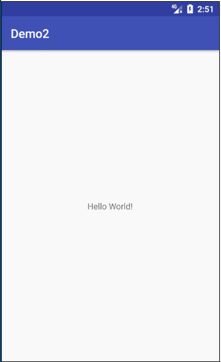

# ImageViewer

## Screenshot



## Usage

Add it in your root build.gradle at the end of repositories:

	allprojects {
		repositories {
			...
			maven { url 'https://jitpack.io' }
		}
	}
    
Step 2. Add the dependency

	dependencies {
	        compile 'com.github.Cloudist:ImageViewer:1.0.2'
	}

## Sample Code

```Java
    final ViewpagerCommonAdapter viewpagerCommonAdapter = new ViewpagerCommonAdapter(MainActivity.this);

        viewpagerCommonAdapter.setOnImageSingleClickListener(new OnImageSingleClickListener() {
            @Override
            public void onImageSingleClick(int position, String path, PhotoView photoView) {
                Toast.makeText(MainActivity.this, "onImageSingleClick" + position, Toast.LENGTH_SHORT).show();
            }
        });

        viewpagerCommonAdapter.setOnImageLongClickListener(new OnImageLongClickListener() {
            @Override
            public boolean onImageLongClick(int position, String path, PhotoView photoView) {
                Toast.makeText(MainActivity.this, "onImageLongClick" + position, Toast.LENGTH_SHORT).show();
                return false;
            }
        });

        ImageViewer.newInstance()
            .setIndex(0)
            .setPaths(paths)
            .setAdapter(viewpagerCommonAdapter)
            .setImageLoader(new ImageLoader() {
                @Override
                public void showImage(final int position, String path, ImageView imageView) {
                    final OnLoadListener loadListener = this.getOnLoadListener();
                    final View view = this.getView();

                    loadListener.onStart(position);
                    Glide.with(OCApplication.getContext())
                            .load(path)
                            .listener(new RequestListener<String, GlideDrawable>() {
                                @Override
                                public boolean onException(Exception e, String model, Target<GlideDrawable> target, boolean isFirstResource) {
                                    loadListener.onError(position);
                                    return false;
                                }

                                @Override
                                public boolean onResourceReady(GlideDrawable resource, String model, Target<GlideDrawable> target, boolean isFromMemoryCache, boolean isFirstResource) {
                                    loadListener.onSuccess(position);
                                    return false;
                                }
                            })
                            .into(imageView);
                }
            })
            .show(getSupportFragmentManager(), "ImageViewer");
```

## Customized Adapter

```Java
    public class CustomViewpagerAdapter extends ViewpagerAdapter {

        public CustomViewpagerAdapter(Context context) {
            super(context);
        }

        @Override
        protected View initView(ViewGroup container, int position) {
            return LayoutInflater.from(mContext).inflate(R.layout.demo_photoview, container, false);
        }

        @Override
        protected void loadImage(final int position, String path, View view) {
            final ImageView imageView = (ImageView) view.findViewById(R.id.image_demo);
            //自定义adapter可以在内部直接设置点击事件
            imageView.setOnClickListener(new View.OnClickListener() {
                @Override
                public void onClick(View v) {
                    Toast.makeText(mContext, "demoOnPhotoTap" + position, Toast.LENGTH_SHORT).show();
                }
            });

            imageView.setOnLongClickListener(new View.OnLongClickListener() {
                @Override
                public boolean onLongClick(View v) {
                    Toast.makeText(mContext, "demoOnLongClick" + position, Toast.LENGTH_SHORT).show();
                    return false;
                }
            });

            imageLoader.showImage(position, path, imageView);
        }

    }
```

## Customized ImageViewer init

```Java
    ImageViewer.newInstance()
        .setIndex(0)
        .setPaths(paths)
        .setAdapter(new CustomViewpagerAdapter(MainActivity.this))
        .setImageLoader(new ImageLoader() {
            @Override
            public void showImage(int position, String path, ImageView imageView) {
                Glide.with(OCApplication.getContext())
                        .load(path)
                        .into(imageView);
            }
        })
        .show(getSupportFragmentManager(), "ImageViewer");
```