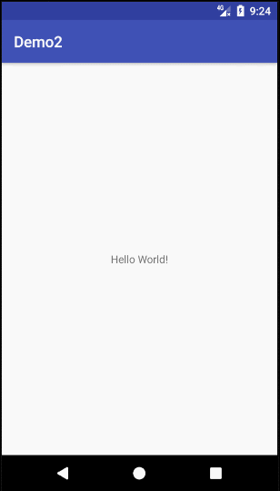

# ImageViewer

## Screenshot



## Usage

Add it in your root build.gradle at the end of repositories:

	allprojects {
		repositories {
			...
			maven { url 'https://jitpack.io' }
		}
	}
    
Step 2. Add the dependency

	dependencies {
	        compile 'com.github.sychaos:ImageViewer:1.0.3'
	}

## Sample Code

```Java
    List<String> paths = new ArrayList();
    ImageViewer.newInstance()
            .setIndex(0)
            .setOnImageSingleClick(new OnImageSingleClick() {
                @Override
                public void onImageSingleClick(int position, String path, PhotoView photoView) {
                    Toast.makeText(MainActivity.this, "onSingleClick" + position, Toast.LENGTH_SHORT).show();
                }
            })
            .setOnImageLongClick(new OnImageLongClick() {
                @Override
                public boolean onImageLongClick(int position, String path, PhotoView photoView) {
                    Toast.makeText(MainActivity.this, "onLongClick" + position, Toast.LENGTH_SHORT).show();
                    return true;
                }
            })
            .setPaths(paths, new ImageTramsform<String>() {
                @Override
                public String tramsformPaths(String path) {
                    return path;
                }
            })
            .setImageLoader(new ImageLoader() {
                @Override
                public void showImage(final int position, String path, PhotoView photoView, final OnLoadListener onLoadListener) {
                    //显示progress
                    onLoadListener.onStart(position);
                    Glide.with(OCApplication.getContext())
                            .load(path)
                            .placeholder(R.mipmap.ic_launcher)
                            .listener(new RequestListener<String, GlideDrawable>() {
                                @Override
                                public boolean onException(Exception e, String model, Target<GlideDrawable> target, boolean isFirstResource) {
                                    //隐藏progress
                                    onLoadListener.onError(position);
                                    return false;
                                }

                                @Override
                                public boolean onResourceReady(GlideDrawable resource, String model, Target<GlideDrawable> target, boolean isFromMemoryCache, boolean isFirstResource) {
                                    //隐藏progress
                                    onLoadListener.onSuccess(position);
                                    return false;
                                }
                            })
                            .into(photoView);
                }
            })
            .show(getSupportFragmentManager(), "ImageViewer");
```
